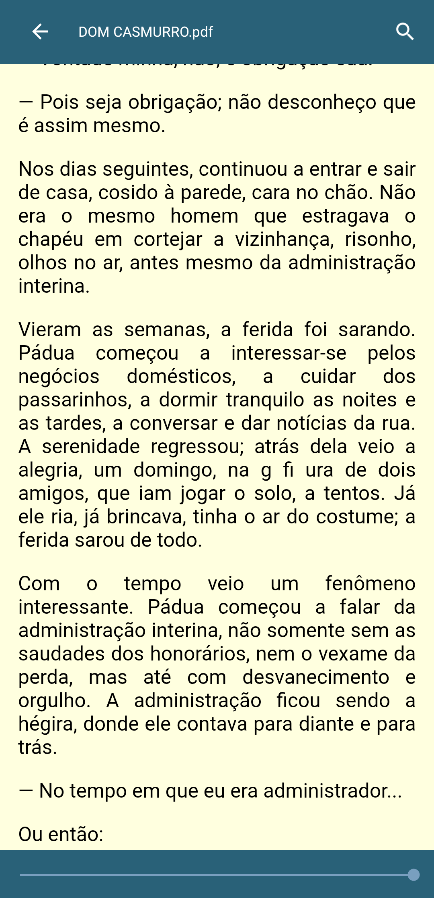

# Leitor de PDF Simplificado para Android

Um aplicativo nativo para Android que transforma a leitura de livros e documentos PDF em uma experiência simples e focada, similar a um e-reader.
O app **extrai o texto dos arquivos PDF** e o exibe em um formato contínuo e ajustável (*reflow*), ideal para leitura em telas de celular.

---

## Funcionalidades Principais

- **Importação de PDFs**: Abra e adicione arquivos `.pdf` diretamente do armazenamento do seu dispositivo.
- **Modo de Leitura Focada**: Texto extraído e formatado em HTML para exibição em uma [`WebView`](https://developer.android.com/reference/android/webkit/WebView), permitindo que ele flua e se ajuste à tela.
- **Progresso Automático**: Salva automaticamente sua última posição de leitura para continuar de onde parou.
- **Biblioteca Organizada**: PDFs mais recentes aparecem no topo da lista.
- **Busca Rápida**: Pesquise palavras ou frases dentro do documento.
- **Gerenciamento Simples**: Arraste para o lado para remover livros da biblioteca.
- **Miniaturas**: Primeira página do PDF usada como miniatura para identificação visual.

---

## Capturas de Tela
<p align="center">
  
  
  
  
  
  
  
</p>

## Instalação e Uso

1. **[Baixar APK](https://drive.google.com/uc?export=download&id=1-Q1y0xj5haSjg9fwsWi-4oNopuPrweU8)**
2. **Instalar no dispositivo**: Habilite a instalação de fontes desconhecidas no seu Android.
3. **Abrir o aplicativo**:
   - Toque em **Adicionar PDF** para importar um arquivo.
   - Comece a ler no **Modo de Leitura Focada**.
   - Use a busca para encontrar palavras específicas.

---

## Para Desenvolvedores

**Linguagem**: Java
**Arquitetura**: UI nativa do Android com `Activities` e `RecyclerView`.
**Banco de Dados**: [`Room Persistence Library`](https://developer.android.com/training/data-storage/room) para armazenar metadados (título, caminho da miniatura, conteúdo extraído e última posição de leitura).

### Processamento de PDF

- [**iTextPDF**](https://itextpdf.com/): Usada para extrair o conteúdo de texto puro de cada página.
- **[`android.graphics.pdf.PdfRenderer`](https://developer.android.com/reference/android/graphics/pdf/PdfRenderer)**: API nativa usada para renderizar a primeira página em `Bitmap`, gerando a miniatura.

### Visualização

- Texto extraído envolvido em HTML simples e carregado em `WebView`, aproveitando recursos nativos da web como:
  - Busca de texto (`findAllAsync`)
  - Formatação flexível
 
### Como Compilar

1. Clone o repositório:
   ```bash
   git clone https://github.com/VictoriaCMoraes/PdfView
   
2. Abra o projeto no Android Studio.

3. O Gradle vai baixar automaticamente todas as dependências.

4. Conecte um dispositivo Android ou use o emulador.

5. Clique em Run para compilar e instalar o app.

---

## Melhorias Futuras

- [ ] Implementar biblioteca de carregamento de imagens ([Glide](https://github.com/bumptech/glide) ou [Coil](https://coil-kt.github.io/coil/)) para miniaturas.
- [ ] Migrar `RecyclerView` para [`ListAdapter`](https://developer.android.com/reference/androidx/recyclerview/widget/ListAdapter) e [`DiffUtil`](https://developer.android.com/reference/androidx/recyclerview/widget/DiffUtil) para melhor performance.
- [ ] Adicionar visualização de PDF "real", permitindo alternar entre texto extraído e página original.
- [ ] Adicionar suporte a *Migrations* do Room para atualizações futuras.

---

## Licença

Este projeto está sob a licença MIT — consulte o arquivo [LICENSE](LICENSE) para mais detalhes.
